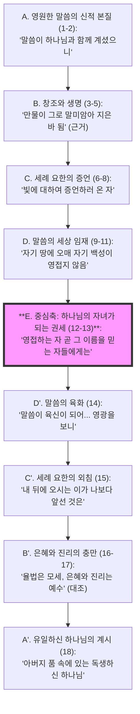

# 요한복음 1장 1절 주해 (Bible Analyze 6.0 Pro)

**분석 일시:** 2025-11-20
**분석 도구:** 성경구절분석 6.0 Pro
**본문:** 요한복음 1장 1절

---

## 1단계: 거시적 구조 및 문맥 분석 (Macro-Structural Analysis)

**Role:** Biblical Literary Architect

### 1. 본문 확정 및 페리코페 (Pericope Determination)
*   **확정된 본문:** 요한복음 1장 1절 (John 1:1)
*   **페리코페 범위:** **요한복음 1:1-18 (프롤로그)**
    *   **외적 표지:** NA28 등 주요 원문 비평판은 1-18절을 하나의 서문으로 구분하며, 19절부터 서사적 전개("유대인들이... 보낼 때에")가 시작됨을 명시함. 고대 사본(P66 등)에서도 이 구분이 지지됨.
    *   **내적 표지:** 1-18절은 시공간을 초월한 영원과 신학적 진술(Logos Hymn)이 주를 이루며, 19절부터 구체적인 역사적 현장(베다니)으로 무대가 전환됨.
    *   **TC 게이트웨이:** 1-18절 내에는 구조를 뒤흔들만한 결정적인 사본 변이는 없으나, 18절의 "독생하신 하나님(monogenēs theos)" vs "독생자(monogenēs huios)" 이독은 기독론적 결론에 중대한 영향을 미치므로 주시해야 함. (본 분석에서는 가장 권위 있는 독법인 *monogenēs theos*를 따름.)

### 2. 문학적 구조 시각화 (Literary Structure)
이 단락은 정교한 **교차대구(Chiasm)**와 **논리적 상승(Staircase)** 구조를 동시에 가짐.

### 3. 문맥적 위치 (Contextual Positioning)
*   **준비와 토대 (Foundation):** 이 프롤로그는 복음서 전체의 '서곡'으로서, 이후 전개될 예수의 7가지 표적(Semeia)과 강화(Discourse)가 단순한 기적이나 교훈이 아니라, **'창조주 하나님의 자기 계시'**임을 선언하는 신학적 토대임.
*   **전환점:** 1장 1절의 '태초(Archē)'는 창세기 1:1의 옛 창조를 상기시키며, 이제 예수 그리스도를 통한 **'새 창조'**가 시작됨을 알리는 거대한 전환점임.

---

## 2단계: 미시적 문헌학 분석 (Discourse Analyst)

**Role:** Discourse Analyst & Philologist

### 1. 구문 및 담화 정밀 분석 (Table A)

| 절 (Cola) | 원문 (Text) & 형태소/상 | 구문론 & 의미관계 (RST) | 담화 정보 구조 (Info Structure) | 강조 표지 & 번역 포인트 | 사전적 의미 (LN) & TC 메모 |
| :--- | :--- | :--- | :--- | :--- | :--- |
| **1a** | **Ἐν ἀρχῇ ἦν ὁ λόγος,** *(En archē ēv ho logos)* • 동사: **ἦν (ēn)** • 상(Aspect): 미완료 (지속/배경) • 어휘상: 상태 (State) | • **Ἐν ἀρχῇ:** 시간 부사구 • **ὁ λόγος:** 주어 • **기능:** 서술 (Narrative Setting) | • **전경(Foreground):** 아니오 (배경 설정) • **주제(Topic):** 말씀 (Logos) • **초점(Focus):** 태초에 (En archē) | • **[전면화]** `Ἐν ἀρχῇ`를 문두에 배치하여 창 1:1을 소환. • **번역:** "태초에, **이미** 말씀이 계셨다." (존재의 선재성 강조) | • **ἀρχή:** 기원, 시작 (LN 67.65) • **λόγος:** 말씀, 계시 (LN 33.98) |
| **1b** | **καὶ ὁ λόγος ἦν πρὸς τὸν θεόν,** *(kai ho logos ēn pros ton theon)* • 동사: **ἦν** (미완료/상태) | • **πρὸς τὸν θεόν:** 전치사구 (서술보어) • **기능:** 관계 묘사 • **RST:** 1a의 상세화 (Elaboration) | • **주제:** 말씀 • **초점:** 하나님과 함께 (pros ton theon) | • **[전치사 pros]** 단순한 '곁에(para)'가 아니라 **'~을 향하여'**라는 지향성을 가짐. • **번역:** "그 말씀은 하나님을 **마주하여** 계셨다." | • **πρὸς:** ~을 향해, 친밀한 관계 (LN 89.113) • 인격적 상호작용 암시. |
| **1c** | **καὶ θεὸς ἦν ὁ λόγος.** *(kai theos ēn ho logos)* • 동사: **ἦν** (미완료/상태) | • **θεὸς:** 주격 보어 • **ὁ λόγος:** 주어 • **RST:** 1a, 1b의 정점/결론 | • **초점:** 하나님 (Theos) • **정보:** 말씀의 본질(Identity) | • **[전면화 & 무관사]** `θεὸς`가 문두에 오고 관사가 없음. 이는 '대상'이 아니라 **'본질/속성(Qualitative)'**을 강조. • **번역:** "그리고 그 말씀은 다름 아닌 **하나님**이셨다." | • **θεός:** 신, 하나님 (LN 12.1) • *TC:* 이독 없음. 문법적 해석(Colwell's Rule) 중요. |

### 2. 사역 (Private Translation)
본문의 담화적 특징(전면화, 미완료 시제, 전치사의 뉘앙스)을 살린 직역임.

> **"태초에, (이미) 말씀이 계셨다. 그리고 그 말씀은 하나님을 (마주하여) 향해 계셨다. 그리고 (놀랍게도) 하나님이셨다, 그 말씀은."**

### 3. 정밀 분석 해설
1.  **상(Aspect)의 신학:** 요한은 세 문장 모두 **미완료 시제(Imperfect, ἦν)**를 사용함. 이는 말씀이 어느 시점에 '창조된(aorist)' 것이 아니라, 태초의 시점에 **'이미 지속적으로 존재하고 있었다'**는 **절대적 선재성(Pre-existence)**을 문법적으로 확증함.
2.  **담화적 강조(Prominence):**
    *   **1a:** `En archē`(태초에)의 전면화는 독자를 창조의 현장으로 데려감.
    *   **1c:** `Theos`(하나님)의 전면화는 로고스가 피조물이 아닌 **'창조주와 동일한 본질'**임을 충격적으로 선포함. 이는 당시 유대교 유일신 사상과 헬라의 이원론을 동시에 깨뜨리는 파격임.
3.  **Pros(πρὸς)의 역동성:** 이 전치사는 정적인 위치가 아니라, 얼굴과 얼굴을 맞대고 있는 **'친밀한 연합과 지향성'**을 보여줌. 이는 삼위일체 내의 사랑의 교제를 암시함.

---

## 3단계: 신학적, 역사적, 상호본문적 종합 (Canonical Theologian)

**Role:** Canonical Theologian & Socio-Rhetorical Critic

### 1. 핵심 개념 및 의미 층위 (Key Concepts)
*   **Logos (말씀):** 요한은 스토아 철학의 '우주 이성(Reason)'과 구약의 '지혜(Sophia)/말씀(Dabar)'을 융합하되, 이를 **'인격적 실체'**로 재정의함. 로고스는 원리가 아니라, **'하나님의 자기 표현(Self-Expression)'인 인격**임.

### 2. 삶의 자리와 사회-수사학적 분석 (Sitz im Leben & Socio-Rhetorical)
*   **삶의 자리:** 요한 공동체는 유대교 회당에서의 축출(Aposynagogos)로 인해 사회적, 종교적 고립감을 겪고 있었음. 이 찬가는 예수님이 유대교의 토라보다 우월한 **'태초의 하나님'**임을 고백하며 공동체의 정체성을 확립하는 예배 의식문(Liturgy)이었을 것임.
*   **사회-수사학적 코드 (1세기):**
    *   **[명예와 수치]:** 십자가에 달려 죽은 예수는 세상의 기준에서 '수치'스러운 존재임. 그러나 요한은 그의 기원을 '태초(Archē)'와 '하나님(Theos)'에 둠으로써, 그에게 **'최상의 귀속된 명예(Highest Ascribed Honor)'**를 부여함. 이는 세상의 평판을 전복시키는 반문화적 선포임.
    *   **[후견인 관계]:** 로고스는 하나님과 인간 사이의 유일하고 완벽한 중보자(Broker)로서, 하나님의 은혜를 우리에게 전달함.

### 3. 상호본문성 및 정경적 궤적 (Canonical Trajectory)
*   **[1단계: 구약 원형]:**
    *   **창세기 1:1:** "태초에 하나님이..." (시간적 기원)
    *   **잠언 8:22-30:** 창조 때 하나님 곁에 있었던 의인화된 '지혜'.
    *   **MT vs LXX:** 시편 33:6의 "여호와의 말씀(Dabar/Logos)으로 하늘이 지음이 되었으며"에서 창조의 도구로서의 말씀 개념이 LXX를 통해 헬라어권 유대인들에게 익숙해짐.
*   **[2단계: 제2성전기]:** 지혜서(Wisdom of Solomon) 등에서 지혜는 하나님의 영광의 발산이자 거울로 묘사됨.
*   **[3단계: 기독론적 성취]:** 요한복음 1:1은 이 추상적인 지혜/말씀이 바로 **'역사적 예수'**임을 선포.
*   **[4단계: 종말론적 완성]:** 요한계시록 19:13, "그 이름은 **하나님의 말씀**이라 칭하더라." 심판주로 오실 예수님의 이름이 여전히 '말씀'임은 태초의 창조주가 곧 종말의 심판주임을 확증함.

### 4. 핵심 논쟁 및 리스크 관리
*   **핵심 논쟁 (아리우스 vs 아타나시우스):** 1c절의 무관사 *theos*를 근거로 여호와의 증인은 "a god(신적 존재)"으로 번역하며 예수의 신성을 격하함. 그러나 이는 헬라어 문법(Colwell's Rule)상 **'본질의 동일성'**을 나타내는 표현임이 정통적 해석임.
*   **리스크 관리:** 이 본문을 타종교에 대한 공격 도구로만 사용하기보다, 기독교 진리의 **'배타적 유일성'**과 **'보편적 포용성(모든 사람의 빛)'**을 동시에 견지하는 균형이 필요함.

### 5. 참고 문헌 및 자료 (Bibliography & Resources)
본 분석에 참조한 권위 있는 학술 문헌 및 자료임.

#### A. 본문 비평 및 원어 (Textual Criticism & Philology)
*   **Nestle-Aland:** *Novum Testamentum Graece*, 28th Edition (NA28). Deutsche Bibelgesellschaft.
*   **Metzger, Bruce M.:** *A Textual Commentary on the Greek New Testament*. UBS.
*   **Louw, J. P. & Nida, E. A.:** *Greek-English Lexicon of the New Testament Based on Semantic Domains*. UBS. (LN)
*   **Bauer, W., Danker, F. W., et al.:** *A Greek-English Lexicon of the New Testament and Other Early Christian Literature* (BDAG). University of Chicago Press.
*   **Wallace, Daniel B.:** *Greek Grammar Beyond the Basics: An Exegetical Syntax of the New Testament*. Zondervan.

#### B. 주석 및 신학 (Commentaries & Theology)
*   **Schnackenburg, Rudolf:** *Das Johannesevangelium*. Herders Theologischer Kommentar zum Neuen Testament (HThKNT). Herder.
*   **Bultmann, Rudolf:** *Das Evangelium des Johannes*. Kritisch-exegetischer Kommentar über das Neue Testament (KEK). Vandenhoeck & Ruprecht.
*   **Carson, D. A.:** *The Gospel according to John*. The Pillar New Testament Commentary (PNTC). Eerdmans.
*   **Keener, Craig S.:** *The Gospel of John: A Socio-Rhetorical Commentary*. Baker Academic.
*   **Hays, Richard B.:** *Echoes of Scripture in the Gospels*. Baylor University Press. (상호본문성)

---

## 4단계: 상황화된 설교 프레임워크 (Contextual Homiletics)

**Role:** Contextual Preacher

### 1. 중심 메시지 (The Big Idea)
**"당신의 존재는 불안한 세상의 우연이 아니라, 영원한 말씀(Logos)의 변함없는 사랑 안에 뿌리내리고 있습니다."**

### 2. 설교 대지 (Tracing the Text)
Step 2의 담화적 강조점을 설교의 뼈대로 삼음.

*   **대지 1: 흔들리지 않는 시작 ("태초에 말씀이 계시니라")**
    *   *근거:* 1a절 `En archē`(태초에)의 **전면화**.
    *   *내용:* 세상은 출신, 학벌, 연봉으로 우리의 시작을 평가하지만, 우리의 진짜 기원은 '태초의 말씀'입니다. 세상이 평가하기 전부터 우리는 그분의 계획 안에 있었습니다. (존재의 안정성)
*   **대지 2: 고립되지 않는 관계 ("말씀이 하나님과 함께 계셨으니")**
    *   *근거:* 1b절 `pros`(향하여)의 **지향성**.
    *   *내용:* 태초에 있었던 것은 '고독'이 아니라 '사랑의 사귐'이었습니다. 하나님은 우리를 그 사랑의 교제 안으로 초대하십니다. 우리는 고독사 사회, 단절된 관계 속에서도 결코 혼자가 아닙니다. (관계의 회복)
*   **대지 3: 압도적인 영광 ("이 말씀은 곧 하나님이시니라")**
    *   *근거:* 1c절 `Theos`(하나님)의 **전면화**.
    *   *내용:* 우리에게 오신 분은 단순한 성인이 아니라 창조주 하나님이십니다. 그분이 나의 삶에 개입하신다는 것은 내 인생이 '신의 이야기'가 된다는 뜻입니다. 이것이 우리의 자존감이자 명예입니다. (본질의 존엄)

### 3. 한국적 상황화 연결 (Contextual Bridge)
*   **[1세기 명예/수치] → [21세기 체면/비교 문화]:**
    *   1세기 사람들이 가문의 출신으로 사람을 평가했듯, 현대 한국인은 아파트 평수와 직장으로 서로를 평가하며 '수치심'을 줌.
    *   그러나 요한은 우리의 '소속'을 하나님께 둠으로써 세상의 평가 시스템을 무력화함. 이것이 진짜 **'거룩한 자존감'**임.

### 4. 구체적 행동 습관 (Action Plan)
*   **[Action 1: 디지털 다이어트] (비용: 0원 / 시간: 하루 10분):**
    *   아침 기상 후 10분간 스마트폰(세상의 소리)을 켜지 않고, 요한복음 1:1을 세 번 낭독하며 "나는 말씀 안에 있습니다"라고 고백하기.
*   **[Action 2: 관계의 지향성 회복] (비용: 커피 1잔 값 / 시간: 이번 주):**
    *   `pros`(~을 향하여)의 정신을 실천하기 위해, 평소 껄끄럽거나 소원했던 한 사람에게 "당신을 생각하며 기도했습니다"라는 메시지와 함께 기프티콘 보내기. (단절을 넘어서는 지향성)

---

## 🛑 Quality Assurance Report (Final Checklist)
*   **Step 1:** 페리코페를 1-18절로 확정하고, 교차대구 구조를 시각화함.
*   **Step 2:** '미완료 시제(지속)'와 '전면화(강조)'를 분석하여 신학적 의미(선재성, 본질) 도출함.
*   **Step 3:** Hays 기준에 따른 상호본문성 검증 및 4단계 정경 궤적(LXX 포함) 서술함.
*   **Step 4:** 담화적 강조점(전면화, 전치사)을 설교 대지로 연결하고, 구체적 행동 지침(10분, 커피값) 제시함.

