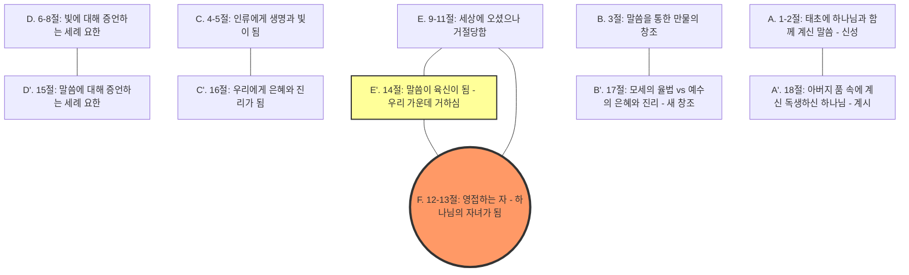

# 요한복음 1장 1절 주해 (Bible Analyze 6.0 Pro)

> **분석 대상:** 요한복음 1:1
> **날짜:** 2025-11-20
> **모델:** Bible Analyze 6.0 Pro (Gemini)

---

## Step 1: 거시적 구조 및 문맥 분석 (Literary Architect)

### 1. 페리코페 확정 (Pericope Delimitation)

**권장 범위:** **요한복음 1장 1절 ~ 18절 (The Prologue)**

**선정 이유:**
1.  **문학적 장르 (Genre):** 1절부터 18절까지는 고도로 정제된 **'찬양시(Hymn)'** 또는 **'시적 산문(Poetic Prose)'**의 형식을 띱니다. 반면 19절("유대인들이... 보낼 때에")부터는 시간과 장소, 인물이 구체화되는 전형적인 **'서사(Narrative)'**로 장르가 급격히 전환됩니다.
2.  **수미상관 (Inclusio):**
    *   1절: "말씀이 **하나님**과 함께 계셨으니... 이 말씀은 곧 **하나님**이시니라"
    *   18절: "아버지 품 속에 있는 독생하신 **하나님**이 나타내셨느니라"
    *   처음과 끝이 '하나님(Theos)'과 '말씀/아들의 선재성'으로 완벽하게 닫힌 구조를 형성합니다.
3.  **주제적 완결성:** 1절은 18절까지 이어지는 거대한 서곡(Overture)의 첫 마디입니다. 1절을 이해하기 위해서는 14절의 '성육신(Incarnation)'과 18절의 '계시(Revelation)'까지를 한 호흡으로 읽어야만 '로고스'의 궤적을 온전히 파악할 수 있습니다.

### 2. 문학적 구조 시각화 (Literary Structure)

이 단락(1:1-18)은 정교한 **교차대구 구조(Chiastic Structure)**로 배치되어 있습니다. 이는 히브리 시문학의 특징이 반영된 것으로, 독자의 시선을 중앙의 핵심 메시지로 이끌어 줍니다.

**구조 해설:**
*   구조의 중심(Center)은 **12-13절(하나님의 자녀 됨)**과 **14절(성육신)**입니다.
*   A와 A'는 로고스의 신적 기원을, B와 B'는 창조와 율법(새 창조)을 대조합니다.
*   이 구조는 1절의 '말씀'이 단순히 추상적인 개념이 아니라, 역사 속으로 뚫고 들어와(14절), 믿는 자들을 하나님의 자녀로 만드는 권세(12절)를 부여하는 존재임을 강조합니다.

### 3. 문맥적 위치 (Contextual Positioning)

이 단락(Prologue)은 요한복음 전체의 **'렌즈(Lens)'** 역할을 합니다.

*   **거시적 전후 관계 (Canonical Context):**
    *   **창세기 1:1과의 연결:** "태초에(In the beginning)"라는 시작은 창세기의 창조 기사를 의도적으로 상기시킵니다. 옛 창조가 말씀으로 이루어졌듯, 새 창조 역시 이 말씀(예수)을 통해 시작됨을 선포합니다.
*   **책 내부의 위치 (Literary Context):**
    *   **서곡(1:1-18) → 표적의 책(1:19-12장) → 영광의 책(13-20장):**
        이 서문은 독자에게 예수님이 누구신지(선재하신 하나님)를 미리 알려주고(Spoiler) 이야기를 시작합니다. 따라서 독자는 이후 전개될 예수님의 사역(표적)과 죽음(영광)을 인간 예수의 실패가 아닌, 성육신하신 로고스의 자기 계시 과정으로 읽어낼 수 있게 됩니다. 1절은 이 모든 드라마의 '존재론적 기원'을 선포하는 닻(Anchor)입니다.

### 4. 학문적 제목 제안

*   **독일어 (German):** *Der Prolog des Johannesevangeliums* (요한복음의 서문) 또는 *Der Logos-Hymnus* (로고스 찬가)
*   **영어 (English):** *The Prologue to the Fourth Gospel* (제4복음서 서문) 또는 *The Hymn of the Incarnate Word* (성육신한 말씀의 찬가)

---

## Step 2: 미시적 문헌학 분석 (Discourse Analyst)

**참조 텍스트:** NA28 (Novum Testamentum Graece, 28th Edition)

### Table A: 텍스트 비평 및 구문 분석표

| 절 (Verse) | 구 (Clause) | 원문 (Original Text) | 형태소 및 상(Aspect) 분석 (Morphology & Aspect) | 구문론적 기능 (Syntactic Function) | 담화 기능 (Discourse Function) | 사전적 의미 및 Louw-Nida (Lexical & LN) |
| :--- | :--- | :--- | :--- | :--- | :--- | :--- |
| **1:1a** | `Ἐν ἀρχῇ` | **Ἐν ἀρχῇ** (En archē) | 전치사(En) + 명사(archē), 여격, 여성, 단수 | 시간 부사구 (Temporal Adverbial Phrase) | **강조 (Fronting):** 문두에 위치하여 시간적 기원을 최우선 정보로 제시. | **시초에** [LN 67.65] (시간의 시작점) |
| | `ἦν` | **ἦν** (ēn) | 동사(eimi), 미완료(Imperfect), 능동태, 직설법, 3인칭, 단수 | 서술어 (Predicate) | **배경 (Background):** 새로운 사건이 발생한 것이 아니라, 이미 지속되고 있던 상태를 묘사. | **있었다/계속 계셨다** [LN 13.1] (존재하다) |
| | `ὁ λόγος` | **ὁ λόγος** (ho logos) | 관사(ho) + 명사(logos), 주격, 남성, 단수 | 주어 (Subject) | **주제 (Topic):** 이 단락의 핵심 화제임을 표시. | **그 말씀** [LN 33.98] (커뮤니케이션, 계시의 주체) |
| **1:1b** | `καὶ ὁ λόγος` | **καὶ ὁ λόγος** (kai ho logos) | 접속사 + 관사 + 명사, 주격, 남성, 단수 | 주어 (Subject) | 주제의 지속 및 새로운 정보 추가의 시작. | 그리고 그 말씀이 |
| | `ἦν` | **ἦν** (ēn) | 동사(eimi), 미완료(Imperfect), 능동태, 직설법, 3인칭, 단수 | 서술어 (Predicate) | 배경 (Background) - 관계적 상태의 지속. | **계속 계셨다** [LN 13.1] |
| | `πρὸς τὸν θεόν` | **πρὸς τὸν θεόν** (pros ton theon) | 전치사(pros) + 관사 + 명사(theos), 대격, 남성, 단수 | 관계/장소 부사구 (Prepositional Phrase) | **초점 (Focus):** 말씀이 누구와 함께 있었는지를 강조. | **하나님을 향하여/함께** [LN 89.113] (연합, 친밀한 관계) |
| **1:1c** | `καὶ θεὸς` | **καὶ θεὸς** (kai theos) | 접속사 + 명사, 주격, 남성, 단수 | 주격 보어 (Predicate Nominative) | **강조 (Fronting):** 보어가 동사 앞으로 도치되어 '신성(Deity)'을 강력하게 강조. | 그리고 **하나님**(이) [LN 12.1] (신적 본질) |
| | `ἦν` | **ἦν** (ēn) | 동사(eimi), 미완료(Imperfect), 능동태, 직설법, 3인칭, 단수 | 서술어 (Predicate) | 배경 (Background) - 본질적 상태의 지속. | **계속 이었다** [LN 13.1] |
| | `ὁ λόγος` | **ὁ λόγος** (ho logos) | 관사 + 명사, 주격, 남성, 단수 | 주어 (Subject) | 주제의 재확인. | **그 말씀(은)** [LN 33.98] |

### 심층 문법 및 담화 해설 (Grammatical & Discourse Highlights)

**1. 동사 상(Verbal Aspect): 미완료(Imperfect)의 '내부적 시선'**
*   **분석:** 1절의 동사 `ἦν`은 모두 **미완료 과거(Imperfect)**입니다. 3절의 창조 기사에서 사용된 부정과거(Aorist, `ἐγένετο` - 생겨났다/발생했다)와 날카롭게 대조됩니다.
*   **담화적 의미:** 저자는 '태초'라는 시점을 마치 비디오카메라로 찍듯이 보여주는데, 그 시점에 말씀은 '새롭게 등장'한 것이 아니라 **'이미 존재하고 있는 중(stative aspect)'**으로 묘사됩니다. 이는 말씀의 **선재성(Pre-existence)과 영원성**을 문법적으로 웅변합니다.

**2. 어순 도치(Fronting)와 정보 구조**
*   **`Ἐν ἀρχῇ` (태초에):** 문장의 맨 앞에 위치하여 이 이야기의 배경이 역사적 시간 이전에 있음을 선포합니다.
*   **`θεὸς ἦν ὁ λόγος` (하나님이셨다 그 말씀은):** 일반적인 어순(주어-동사-보어)이라면 `ὁ λόγος ἦν θεὸς`여야 합니다. 그러나 `θεὸς`가 문두로 튀어나왔습니다(Fronting).
    *   **의도:** 저자는 말씀의 정체성 중 가장 충격적인 사실, 즉 그분이 **'하나님(Godness/Deity)'**이라는 점을 독자의 눈앞에 들이밀고 싶어 했습니다. "그리고 (놀랍게도) **하나님**이셨다, 그 말씀은!"

**3. `πρὸς τὸν θεόν` (pros ton theon) - 관계의 역동성**
*   **분석:** 정적인 '옆에(`para`)'가 아니라 방향성을 가진 '향하여(`pros`)'를 사용했습니다.
*   **의미:** 이는 두 인격 사이의 **'마주 봄(Face to face)'**과 **'능동적인 교제'**를 암시합니다. 태초의 상태는 정적인 고요가 아니라, 성부와 성자 간의 역동적인 사랑의 대화였습니다.

---

## Step 3: 신학적, 역사적, 상호본문적 종합 (Canonical Theologian & Socio-Rhetorical Critic)

### 1. 심층 의미 분석 (Semantic Analysis)

*   **Logos (λόγος, LN 33.98):** 단순한 '말'이 아닙니다. 요한은 이 단어를 통해 헬라 철학의 '우주적 이성'과 유대교의 '창조적 말씀'을 통합합니다. 하지만 1:14에서 이 로고스가 '육신'이 됨으로써, 철학적 추상성을 완전히 깨뜨리고 **'인격적 계시자'**로 재정의합니다.

### 2. 배경 연구 (Contextual Background)

**A. 해석사적 궤적과 핵심 논쟁 (Wirkungsgeschichte & Key Debate)**
*   **🔥 핵심 논쟁 (Key Debate): 로고스의 본질 (The Nature of Logos)**
    *   **고대 교회 (아리우스 논쟁):** 아리우스는 "그 말씀은 하나님이셨다"의 `Theos`에 관사가 없음을 근거로 성자를 '피조된 신(a god)', 즉 성부보다 열등한 존재로 주장했습니다. 반면 아타나시우스는 문맥과 문법(Colwell's Rule의 선구적 이해)을 통해 성자의 완전한 신성을 옹호했습니다.
    *   **종교개혁 (칼빈):** 칼빈은 로고스를 '하나님의 영원한 지혜'로 해석하며, 그리스도의 신성을 강조함과 동시에, 그가 성육신하기 전에도 구약의 성도들에게 하나님을 계시했던 '중보자'였음을 강조했습니다 (*Autotheos* 논쟁).
    *   **현대 (불트만 vs. 케제만):** 루돌프 불트만은 로고스 개념의 기원을 '영지주의 신화(Gnostic Myth)'에서 찾으려 했으나, 에른스트 케제만과 이후 학자들은 이를 유대교 지혜 전승과 헬레니즘 유대교(필론)의 배경에서 이해하는 것이 훨씬 타당함을 입증했습니다.

**B. 사회-수사학적 분석 (Socio-Rhetorical Analysis)**
1.  **명예와 수치 (Honor & Shame)**
    *   1세기 지중해 문화에서 '출신(Origin)'은 개인의 명예를 결정하는 핵심 요소였습니다. 요한은 예수님의 기원을 '나사렛'이나 '베들레헴'이 아닌 **'태초의 하나님 품 속'**으로 설정함으로써, 십자가 처형이라는 세상의 '수치'를 압도하는 최고의 '귀속 명예(Ascribed Honor)'를 예수님께 부여합니다.
2.  **후견인 관계 (Patron-Client Relationship)**
    *   로고스는 하나님(Patron)과 세상(Client)을 연결하는 유일한 중보자(Broker)로 제시됩니다. 당시 황제가 신의 아들로서 세상의 평화를 보장한다고 선전했지만, 요한은 오직 로고스만이 하나님과 태초부터 교제해 온 진정한 중보자임을 선포하며 황제 숭배 이데올로기에 저항합니다.

### 3. 상호본문성 및 정경적 궤적 (Canonical Trajectory)

**A. [구약 원형] 창조의 말씀과 지혜 (Gen 1:1, Prov 8:22)**
*   창세기 1:1의 "태초에(`Bereshit`)"와 시편 33:6의 "여호와의 말씀(`Dabar`)"이 직접적인 배경입니다. 잠언 8장의 '지혜(`Hokmah`)'가 창조의 장인으로 묘사된 전통을 계승합니다.

**B. [제2성전기 발전] 로고스와 멤라 (Memra)**
*   중간기 문헌(지혜서, 필로)에서 '지혜'와 '로고스'는 하나님과 세상을 중재하는 존재로 발전합니다. 아람어 탈무드(Targum)는 하나님을 직접 거명하는 것을 피하기 위해 '멤라(Memra, 말씀)'라는 개념을 사용했습니다. 요한은 이 개념을 가져와 예수님께 적용합니다.

**C. [기독론적 성취] 성육신한 말씀 (John 1:1, 14)**
*   추상적 개념이었던 로고스가 역사적 인물 '예수'와 동일시됩니다. 이는 유대교 유일신론 내에 '성부와 성자'라는 관계성을 도입하는 혁명적 성취입니다.

**D. [종말론적 완성] 피 뿌린 옷을 입은 말씀 (Rev 19:13)**
*   요한계시록에서 재림하시는 그리스도의 이름은 "하나님의 말씀"입니다. 태초의 창조주이신 말씀은 종말에 심판주와 완성자로 다시 오십니다. 말씀으로 시작된 역사는 말씀으로 완성됩니다.

### 4. 다양한 해석학적 렌즈 (Diverse Hermeneutical Lenses)

**렌즈: 포스트콜로니얼 비평 (Postcolonial Criticism)**
*   **제국의 로고스 vs. 저항의 로고스:** 로마 제국은 황제의 명령(Edict)을 법이자 질서(Logos)로 강요했습니다. 요한복음의 로고스 선언은 이러한 제국의 폭력적 질서에 대항하는 '대안적 질서'의 선포입니다. 세상은 무력으로 통치되지만, 참된 우주는 하나님의 '자기 내어줌(Self-giving)'과 '사랑의 교제'인 말씀으로 통치됩니다. 이는 오늘날 자본과 무력이 지배하는 신제국주의 질서 속에서 교회가 선포해야 할 저항적 메시지입니다.

### 5. 지평의 구분 (Distinction of Horizons)

*   **성서신학:** 요한은 예수를 유대교의 유일신 신앙을 파괴하지 않으면서도 하나님과 동등한 분으로 소개하려 했습니다.
*   **조직신학:** 1:1은 훗날 니케아 공의회에서 **'동일본질(Homoousios)'** 교리를 확립하는 흔들리지 않는 기초가 되었습니다.

### 6. 참고 문헌 (Bibliography)

1.  **[독일어권 표준 - Protestant]** **Schnackenburg, Rudolf.** *Das Johannesevangelium*. HThKNT. Freiburg: Herder. (가톨릭 학자이나 학문적 권위는 보편적임).
2.  **[독일어권 표준 - Classic]** **Bultmann, Rudolf.** *Das Evangelium des Johannes*. KEK. Göttingen: Vandenhoeck & Ruprecht.
3.  **[영어권 복음주의 표준]** **Carson, D. A.** *The Gospel according to John*. PNTC. Eerdmans, 1991.
4.  **[사회-수사학적 연구]** **Keener, Craig S.** *The Gospel of John: A Socio-Rhetorical Commentary*. Baker Academic, 2003.

---

## Step 4: 상황화된 설교 프레임워크 (Contextual Homiletics)

**주제:** 혼돈의 시대, 변하지 않는 삶의 원점(原點)

### 1. 중심 메시지 (The Big Idea)
**"당신의 불안이 시작되기 전, 흔들리지 않는 삶의 기초인 '말씀(Logos)'은 이미 거기에 계셨습니다."**

### 2. 한국적 상황화 연결 (Contextual Connection)

*   **키워드:** **무한 경쟁, 피로 사회, 불확실성(Anxiety)**
*   **상황 분석:** 현대 한국인은 자신의 존재 가치를 '실적(Doing)'과 '소유(Having)'로 증명해야 한다는 강박에 시달립니다. "내가 도태되면 어떡하지?"라는 생존 불안이 삶을 지배합니다. 모든 것이 빠르게 변하는 유동적인 세상(Liquid Modernity)에서, 사람들은 삶을 지탱할 **'단단한 바닥(Foundation)'**을 잃어버렸습니다.
*   **접점:** 요한복음 1:1은 이 '유동적인 세상'에 대항하여, 태초부터 존재했던 '견고한 상수(Constant)'인 예수 그리스도를 제시합니다. 변화무쌍한 세상의 소리(News, SNS)가 아닌, 변하지 않는 말씀(Logos)에 접속할 때 비로소 인간은 안식을 얻습니다.

### 3. 설교 프레임워크 (Sermon Structure)

#### **서론 (Hook): "당신의 '태초'는 언제입니까?"**
*   **실존적 질문:** 여러분의 하루는 무엇으로 시작됩니까? 스마트폰 알람? 밀린 카톡 확인? 주식 차트? 우리는 눈을 뜨자마자 세상의 소음과 근심으로 하루의 '태초'를 채웁니다.
*   **문제 제기:** 현대인의 불행은 우리의 삶이 '불안'에서 시작된다는 점입니다. "스펙이 부족해", "노후가 불안해". 우리는 늘 무언가 결핍된 상태에서 출발합니다. 시작이 흔들리니, 그 위에 쌓아 올린 삶 전체가 흔들립니다.
*   **본문 제시:** 오늘 요한은 우리에게 전혀 다른 시작점을 보여줍니다. 모든 혼돈과 불안이 생겨나기도 전, 이미 존재하고 계셨던 한 분을 소개합니다.

#### **본론 (Book): 흔들리지 않는 세 가지 기둥**

**대지 1. 선재하시는 하나님: "불안보다 먼저 계신 분" (En archē ēn...)**
*   **해석 (Step 2 `ēn`의 상):** 헬라어 미완료 시제 `ēn`은 '계속해서 계셨다'는 뜻입니다. 세상이 창조되기도 전, 문제가 발생하기도 전, 당신이 태어나기도 전에 주님은 이미 '거기에' 계셨습니다.
*   **적용:** 우리는 상황이 터지면 당황합니다. 그러나 주님께는 '돌발 상황'이 없습니다. 당신의 고난이 시작된 시점보다, 주님의 은혜가 시작된 시점이 더 앞섭니다. 내 인생의 타이밍이 아니라, 그분의 영원한 타이밍(Eternal Timing)을 신뢰하십시오.

**대지 2. 마주 보시는 하나님: "고독을 이기는 관계" (Pros ton theon)**
*   **해석 (Step 2 `pros`의 방향성):** 말씀은 하나님을 향해 '마주 보고(face to face)' 계셨습니다. 이것은 완벽한 사랑의 교제입니다. 태초에 있었던 것은 '적막'이나 '고독'이 아니라 '대화'였습니다.
*   **적용:** 한국 사회는 '군중 속의 고독'을 앓고 있습니다. SNS로 연결될수록 더 외롭습니다. 우리는 '화면(Screen)'을 마주 보는 존재가 아니라, '하나님'을 마주 보도록 지음 받았습니다. 여러분의 시선(`pros`)을 문제에서 주님께로 돌릴 때, 비로소 고립감이 사라집니다.

**대지 3. 본질이신 하나님: "내 삶을 정의하는 권위" (Kai theos ēn...)**
*   **해석 (Step 2 도치 강조):** `theos`(하나님)가 문장 맨 앞으로 튀어나와 있습니다. 이는 말씀의 본질이 '하나님 그분'임을 강력히 선포하는 것입니다. 이 세상은 우연이나 카오스가 아니라, 하나님의 뜻과 질서(Logos)로 운행됩니다.
*   **적용:** 세상은 당신을 '연봉'이나 '아파트 평수'로 정의하려 합니다. 그것은 세상의 논리입니다. 그러나 우리의 진짜 정체성은 창조주이신 '말씀' 안에 있습니다. 세상의 소리가 나를 규정하게 두지 말고, 창조주의 말씀이 나를 규정하게 하십시오.

#### **결론 (Look & Took): 로고스에 접속하라**

*   **요약:** 우리의 삶이 흔들리는 이유는 기초가 약해서가 아니라, 기초가 잘못되었기 때문입니다. 변하는 것들에 뿌리내리면 흔들릴 수밖에 없습니다.
*   **초청:** 태초부터 계셨고, 지금도 계시며, 영원히 계실 예수 그리스도(Logos)께 여러분의 인생을 '앵커링(Anchoring)' 하십시오.
*   **Action Plan (이번 주 실천 과제):**
    1.  **First Logos:** 아침에 눈을 뜨자마자 스마트폰을 켜기 전, 단 3분이라도 성경(Logos)을 먼저 펴십시오. 세상의 소음보다 하나님의 말씀을 먼저 입력하십시오.
    2.  **Pros Prayer:** 하루에 한 번, 5분간 침묵하며 하나님을 '마주 보는' 시간을 가지십시오. 내가 무엇을 달라고 요구하는 기도가 아니라, 그저 그분의 현존 앞에 머무는 기도입니다.