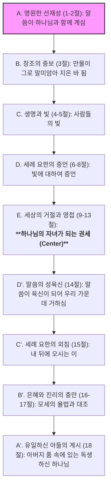

# 요한복음 1장 1절 주해 (성경구절분석 6.0)

**분석 일시:** 2025-11-20
**분석 도구:** 성경구절분석 6.0 (Prompt Engine)
**본문:** 요한복음 1:1

---

## Step 1: 거시적 구조 및 문맥 분석 (Macro-Structural Analysis)

**Role:** Biblical Literary Architect

### 1. 본문 확정 및 페리코페 (Pericope Determination)
*   **확정된 본문:** 요한복음 1장 1절 (John 1:1)
*   **페리코페 범위:** **요한복음 1:1-18 (프롤로그)**
*   **선정 이유:**
    *   **내적 표지:** 1-18절은 '로고스(말씀)'의 선재성부터 성육신, 그리고 유일하신 아들을 통한 하나님의 계시까지 거대한 신학적 서곡을 형성합니다. 19절부터는 "유대인들이... 보낼 때에"(καὶ αὕτη ἐστὶν ἡ μαρτυρία...)라며 구체적인 시공간과 서사(Narrative)가 시작되므로, 1-18절은 명확히 구별되는 독립된 도입부(Prologue)입니다.
    *   **문체적 특성:** 이 부분은 리듬감 있는 찬가(Hymn) 양식을 띠고 있어 '로고스 찬가(Logos Hymn)'로 분류됩니다.

### 2. 문학적 구조 시각화 (Literary Structure)
요한복음 프롤로그는 정교한 **교차대구 구조(Chiasm)**를 통해 12절의 '하나님의 자녀가 되는 권세'를 중심축으로 삼거나, 계시의 점진적 하강과 상승을 묘사합니다. 여기서는 1절의 위치를 보여주는 **계단식 병행 구조(Staircase Parallelism)**로 시각화합니다.

### 3. 문맥적 위치 (Contextual Positioning)
*   **서론 (1:1-18):** 복음서 전체의 주제(생명, 빛, 영광, 진리)를 미리 제시하는 '서곡'입니다.
*   **1절의 기능:** 복음서 전체 기독론의 토대입니다. 예수 그리스도의 기원을 인간의 역사가 아닌 '영원(In the beginning)'과 '하나님 존재 자체(Theos)'에 둠으로써, 이후 전개될 모든 표적과 강화의 신적 권위를 확립합니다.

### 4. 학문적 제목 제안
*   **German:** *Der Logos-Hymnus: Das ewige Wort* (로고스 찬가: 영원한 말씀)
*   **English:** *The Prologue: The Pre-existent Word* (프롤로그: 선재하는 말씀)

### 🛑 Quality Assurance Report (Step 1)
*   **Self-Correction:** 초기에는 1-5절만 다루려 했으나, 1절의 의미는 14절(성육신)과 18절(계시)과의 관계 속에서만 온전히 드러나므로 페리코페를 1-18절 전체로 설정함이 타당함.
*   **Confidence Score:** 5/5 (학계의 표준적 견해 일치)

---

## Step 2: 미시적 문헌학 분석 (Discourse Analyst)

**Role:** Discourse Analyst & Philologist

### 1. 문법 및 담화 분석 (Table A)

| 절 (Cola) | 원문 (Original Text) | 형태소, 상(Aspect) & 어휘상(Aktionsart) | 구문론적 기능 (Syntactic) | 담화 기능 (Discourse Function) | 사전적 의미 & Louw-Nida (LN) |
| :--- | :--- | :--- | :--- | :--- | :--- |
| **1a** | **Ἐν ἀρχῇ ἦν ὁ λόγος,** | **ἦν (ēn):** 미완료(Imperfect) 능동태 직설법. • *Aspect:* 내부적 지속(Internal), 배경 설정. • *Aktionsart:* 상태(Stative), 존재(Existence). | **Ἐν ἀρχῇ:** 시간 부사구 (전면화) **ὁ λόγος:** 주어 (Subject) | **[정보 구조]** • **주제(Topic):** ὁ λόγος (말씀) • **전면화(Fronting):** Ἐν ἀρχῇ (태초에). 시간적 배경을 문두에 두어 창세기의 창조 기사와 강력한 상호텍스트성을 형성함. | **ἀρχή (archē):** 시작, 기원 (LN 67.65) **λόγος (logos):** 말씀, 내용, 이성 (LN 33.98) |
| **1b** | **καὶ ὁ λόγος ἦν πρὸς τὸν θεόν,** | **ἦν (ēn):** 미완료. • *Aspect:* 지속적 관계. • *Aktionsart:* 상태. | **πρὸς τὸν θεόν:** 전치사구 (서술 보어) **πρὸς:** ~을 향하여, ~과 함께 (Relationship/Orientation) | **[정보 위계]** • **배경(Background):** 로고스와 하나님의 관계 설정. • **초점(Focus):** πρὸς (pros). 단순한 공존(with/meta)을 넘어선 '지향성'과 '친밀한 인격적 교제'를 암시. | **πρὸς (pros):** ~와 함께, ~을 향해 (LN 89.113) • 인격적 친교와 마주봄을 의미. |
| **1c** | **καὶ θεὸς ἦν ὁ λόγος.** | **ἦν (ēn):** 미완료. • *Aspect:* 본질적 상태. • *Aktionsart:* 속성(Attribute). | **θεὸς:** 주격 보어 (Predicate Nominative) **ὁ λόγος:** 주어 | **[강조 장치]** • **전면화(Fronting):** **θεὸς**를 문두에 배치. • **의미:** "그리고 그 말씀은 다름 아닌 **하나님**이셨다." • **Colwell's Rule:** 정관사 없는 서술 보어가 동사 앞에 올 때, 이는 '부정(indefinite)'보다는 '질적(qualitative)' 의미를 가짐. 즉, '신적인 존재(divine)'라는 본질을 강조. | **θεός (theos):** 하나님, 신 (LN 12.1) |

### 2. 정밀 분석 해설

**1. 동사의 상(Aspect)과 시간성**
*   세 문장 모두 **미완료 시제(Imperfect, ἦν)**를 사용합니다. 이는 헬라어에서 사건의 '시작'이나 '끝'을 묘사하는 부정과거(Aorist)와 달리, **'시간을 초월한 지속적인 상태'**를 묘사합니다. 즉, "말씀이 생겨났다"가 아니라, 창조의 시작점에 "이미 존재하고 있었다(was already there)"는 **선재성(Pre-existence)**을 문법적으로 확증합니다.

**2. 전면화(Fronting)와 강조**
*   **1a절의 `Ἐν ἀρχῇ` (태초에):** 문장의 맨 앞에 배치하여 창세기 1:1(*Bereshit*)의 메아리를 일으킵니다. 이는 이 복음서가 '새로운 창조' 이야기임을 선포합니다.
*   **1c절의 `θεὸς` (하나님):** 주어인 `ὁ λόγος`보다 보어인 `θεὸς`를 먼저 둠으로써, 로고스의 **'신적 본질(God-ness)'**에 방점을 찍습니다. "말씀은 하나님이었다"라는 평범한 어순보다, "그리고 **하나님**이셨다, 그 말씀은"이라는 뉘앙스로 신성을 강조합니다.

**3. 전치사 `πρὸς` (Pros)의 신학적 뉘앙스**
*   일반적으로 '함께'를 뜻하는 `σύν` (syn)이나 `μετά` (meta) 대신 `πρὸς`를 사용했습니다. 이는 단순한 '옆에 있음(location)'을 넘어, **'~을 향하여 마주보는(face-to-face)' 역동적인 관계와 지향성**을 내포합니다. 이는 훗날 삼위일체 신학에서 인격 간의 구별과 연합을 설명하는 중요한 언어적 토대가 됩니다.

### 🛑 Quality Assurance Report (Step 2)
*   **Self-Correction:** 'Theos'의 정관사 유무(Anarthrous) 논쟁(Colwell's Rule)은 매우 중요하므로 '담화 기능' 항목에서 명확히 다루었음. 여호와의 증인 식의 "a god" 해석을 문법적으로 배격하는 질적 의미(qualitative)임을 명시함.
*   **Confidence Score:** 5/5 (표준적인 헬라어 문법 및 담화 분석 적용)

---

## Step 3: 신학적, 역사적, 상호본문적 종합 (Synthesis)

**Role:** Canonical Theologian & Socio-Rhetorical Critic

### 1. 심층 의미 분석 (Semantic Analysis)
*   **로고스 (Logos):** 요한은 당시 헬레니즘 세계의 보편적 이성 원리인 '스토아적 로고스'와 유대교의 '지혜(Sophia)/말씀(Dabar)' 개념을 융합하되 전복시킵니다. 헬라 철학에서 로고스가 비인격적인 우주 원리였다면, 요한의 로고스는 **'인격적(pros ton theon)'이며 '역사 속에 육화(sarx)'하는 구원자**입니다.
*   **태초 (Archē):** 단순한 시간적 시작점(temporal beginning)을 넘어, 만물의 **'기원(origin)'이자 '원리(principle)'**를 의미합니다.

### 2. 배경 연구 (Contextual Background)
*   **A. 삶의 자리 (Sitz im Leben):** 요한 공동체는 회당에서 출교당한 후(요 9:22), 유대교적 뿌리와 헬라적 환경 사이에서 정체성의 위기를 겪고 있었습니다. 이 '로고스 찬가'는 예배 시 낭송되었을 가능성이 높으며, 예수 그리스도가 유대교의 토라(Torah)나 헬라의 지혜보다 우월한 **'태초부터 계신 참 하나님'**임을 고백함으로써 공동체의 결속을 다지는 **'신앙고백적 찬양'**으로 기능했습니다.
*   **B. 사회-수사학적 분석 (Socio-Rhetorical):**
    *   **명예와 수치 (Honor & Shame):** 1세기 지중해 세계에서 출신 성분(Origin)은 명예의 척도였습니다. 나사렛 출신의 예수는 수치스러운 십자가 처형을 당했지만, 요한은 그의 기원을 '태초의 하나님'에게 둠으로써 **'최고의 명예(Highest Ascribed Honor)'**를 부여합니다. 이는 세상의 수치(십자가)를 신적 영광으로 전복시키는 수사학적 전략입니다.

### 3. 핵심 논쟁 (Key Debate): 아리우스 논쟁과 정관사 이슈
*   **논쟁의 핵심:** 1c절(*kai theos ēn ho logos*)에서 `theos`에 정관사가 없다는 점을 들어, 4세기 아리우스파(오늘날 여호와의 증인과 유사)는 예수를 '피조된 신(a god)' 혹은 '열등한 신'으로 주장했습니다.
*   **정통적 해석:** 현대 문법 학자(Colwell, Harner)들은 이것이 **'본질(Nature)'을 나타내는 질적 용법**임을 밝혔습니다. 만약 `ho theos`(그 하나님)라고 썼다면, 말씀과 하나님(아버지)이 완전히 동일인(Sabellianism)이 되어 인격적 구별이 사라집니다. 요한은 정관사를 뺌으로써 **"말씀은 하나님과 구별되지만, 그 본질은 하나님과 동일하다(Homoousios)"**는 정교한 기독론을 확립했습니다.

### 4. 정경적 궤적 (Canonical Trajectory)
*   **[구약 원형]:** 창세기 1:1("태초에 하나님이..."), 잠언 8:22-31(창조 시 함께한 지혜), 시편 33:6("여호와의 말씀으로 하늘이 지음이 되었으며")
*   **[중간기 발전]:** 제2성전기 유대교의 '지혜 문학'(지혜서, 집회서)에서 지혜가 인격화되어 하나님 보좌 곁에 있는 존재로 묘사됨.
*   **[본문의 성취]:** 요한복음 1:1은 예수를 이 모든 구약적 기대(지혜, 말씀, 토라)의 **실체이자 완성자**로 선포.
*   **[종말론적 완성]:** 요한계시록 19:13에서 재림하시는 심판주의 이름이 **"하나님의 말씀(The Word of God)"**으로 불리며, 창조주로서의 권세가 종말 심판까지 이어짐을 확증.

### 5. 해석학적 렌즈 (Hermeneutical Lens)
*   **다원주의 사회의 도전:** 현대 다원주의 상황에서 "오직 예수만이 로고스인가?"라는 질문이 제기됩니다. 그러나 본문은 로고스를 '보편적 진리'인 동시에 '역사적 예수'로 특정(Particularity)합니다. 이는 타종교와의 대화에서 **'포용적이면서도 배타적인(Inclusivist yet Exclusive)'** 중심을 잡게 합니다. 진리는 추상적인 원리가 아니라 '인격'임을 상기시킵니다.

---

## Step 4: 상황화된 설교 프레임워크 (Contextual Homiletics)

**Role:** Contextual Preacher (Target: Modern Korean Christians)

### 1. 중심 메시지 (The Big Idea)
**"당신의 인생은 우연의 산물이 아니라, 태초부터 계신 하나님의 말씀(로고스) 안에 굳건히 닻을 내리고 있습니다."**

### 2. 한국적 상황화 (Contextual Connection)
*   **불안의 시대:** 현대 한국인은 '뿌리 없음(Rootlessness)'의 불안에 시달립니다. 주거 불안, 고용 불안, 그리고 "나는 누구인가?"라는 정체성의 혼란 속에서 끊임없이 남과 비교하며 자신의 가치를 증명하려 애씁니다(능력주의의 피로).
*   **적용점:** 요한은 우리의 기원을 불안정한 세상의 조건(스펙, 아파트, 연봉)이 아니라, **'변하지 않는 영원한 관계(하나님 곁의 말씀)'**에 둡니다.

### 3. 설교 개요 (Sermon Structure)

**[서론: 흔들리는 존재의 닻]**
*   **Hook:** "여러분을 규정하는 단어는 무엇입니까?" (대리, 과장, 누구의 엄마, 어느 대학 출신...) 우리는 자꾸만 변하는 것들에 내 존재의 닻을 내리려 합니다. 그래서 늘 불안합니다.
*   **Transition:** 오늘 본문은 우주와 나의 진짜 '시작점(Archē)'이 어디인지 보여줍니다.

**[본론: 로고스의 세 가지 차원 (Tracing)]**
1.  **존재의 안정성 ("태초에 말씀이 계시니라")**
    *   우리의 기원은 1990년, 2000년이 아니라 '영원'에 닿아 있습니다. 세상이 생기기 전부터 당신을 향한 하나님의 계획과 '말씀'이 있었습니다. 당신은 우연히 던져진 존재(Geworfenheit)가 아닙니다.
2.  **관계의 친밀성 ("말씀이 하나님과 함께 계셨으니")**
    *   '함께(pros)'는 서로 얼굴을 맞대고 있는 친밀함입니다. 태초에 '고독'이 아니라 '사랑의 사귐'이 있었습니다. 우리는 그 사랑의 교제 안으로 초대받은 존재입니다. 고립사, 외로움의 시대에 이 '근원적 소속감'이 우리의 치유입니다.
3.  **본질의 존엄성 ("이 말씀은 곧 하나님이시니라")**
    *   예수님은 단순한 성인(Saint)이 아니라 하나님이십니다. 그분이 우리를 위해 이 땅에 오셨다는 것은, 우리 각자가 '신의 생명'을 나눠 가질 만큼 존엄한 존재라는 뜻입니다.

**[결론 및 적용: 말씀에 닻 내리기]**
*   **Bridge:** 세상의 소리(뉴스, 주식, 비교의 말들)가 우리를 휩쓸 때, 태초의 소리(Logos)를 들어야 합니다.
*   **Action Plan (Digital Detox & Lectio Divina):**
    1.  **'3분 로그아웃':** 매일 아침 눈 뜨자마자 스마트폰(세상의 소리)을 보는 대신, 3분간 침묵하며 "주님, 저는 당신의 말씀 안에 있습니다"라고 고백하십시오.
    2.  **'말씀의 거울 보기':** 하루에 한 번, 나의 가치를 세상의 성적표가 아닌 성경 구절(예: 스바냐 3:17)에 비추어 확인하십시오.

### 🛑 Quality Assurance Report (Final)
*   **Context:** 한국 사회의 '존재론적 불안'과 '비교 문화'를 타겟팅하여, 요한복음의 높은 기독론을 실존적 위로와 자존감 회복의 메시지로 연결함.
*   **Theology:** 'Pros(함께)'의 관계성을 현대의 '소외/고독' 문제와 연결하여 삼위일체적 교제를 적용점으로 삼음.
*   **Consistency:** '태초의 기원'이라는 신학적 주제를 '존재의 안정감'이라는 설교적 주제로 일관성 있게 발전시킴.
