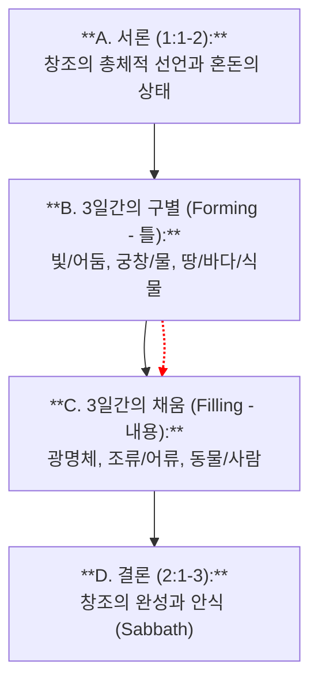

# 창세기 1장 1절 주해 (Bible Analyze 6.0 Pro)

**분석 일시:** 2025-11-20
**분석 도구:** 성경구절분석 6.0 Pro
**본문:** 창세기 1장 1절

---

## 1단계: 거시적 구조 및 문맥 분석 (Macro-Structural Analysis)

**Role:** Biblical Literary Architect

### 1. 본문 확정 및 페리코페 (Pericope Determination)
*   **확정된 본문:** 창세기 1장 1절 (Genesis 1:1)
*   **페리코페 범위:** **창세기 1:1 - 2:3 (천지창조와 안식)**
    *   **외적 표지:** BHS는 1:1-5을 첫 번째 단락(פ)으로 구분하지만, 문학적으로는 '제 칠일(2:3)'까지가 창조 기사의 완결된 단위임. 2:4a부터는 '하늘과 땅의 내력(Toledot)'이라는 새로운 표제어가 등장하며 서사의 관점이 전환됨.
    *   **내적 표지:** 1:1의 '천지 창조' 선언은 2:1의 '천지와 만물이 다 이루어지니라'는 선언과 함께 수미상관(Inclusio)을 이룸. '저녁이 되고 아침이 되니'라는 후렴구가 6일간 반복되다가 7일째 안식으로 종결되는 구조임.
    *   **TC 게이트웨이:** 주요 사본 상의 구조적 변이는 없음.

### 2. 문학적 구조 시각화 (Literary Structure)
이 단락은 **서론-전개-결론**의 논리적 구조와 **틀(Forming)과 채움(Filling)**의 대칭 구조를 가짐.

### 3. 문맥적 위치 (Contextual Positioning)
*   **전후 문맥 연결:**
    *   **Prologue (서막):** 이 구절은 창세기뿐만 아니라 오경(Pentateuch)과 성경 전체의 대전제임. 하나님이 역사의 주관자이자 소유주임을 선포함.
    *   **Toledot (족보) 도입:** 2:4부터 시작되는 인류 역사의 서술 이전에, 그 역사가 펼쳐질 무대(우주)의 기원을 설명함.

---

## 2단계: 미시적 문헌학 분석 (Discourse Analyst)

**Role:** Discourse Analyst & Philologist

### 1. 구문 및 담화 정밀 분석 (Table A)

| 절 (Cola) | 원문 (Text) & 형태소/상 | 구문론 & 의미관계 (RST) | 담화 정보 구조 (Info Structure) | 강조 표지 & 번역 포인트 | 사전적 의미 (LN) & TC 메모 |
| :--- | :--- | :--- | :--- | :--- | :--- |
| **1a** | **בְּרֵאשִׁ֖ית** *(Bereshit)* • 전치사+명사 | • 시간 부사구 • 기능: 배경 설정 (Temporal Setting) | • **전면화(Fronting):** 문두에 위치하여 시간적 기원을 강조. • **초점:** '언제' 시작되었는가? | • **[절대형/연계형 논쟁]** 전통적으로는 절대형("태초에")이나, 문법적으로 연계형("...창조하실 때에") 가능성도 있음. 여기서는 독립된 선언으로 봄. | **רֵאשִׁית:** 시작, 처음, 최상 (LN 67.65) |
| **1b** | **בָּרָ֣א אֱלֹהִ֑ים** *(bara Elohim)* • 동사: **בָּרָא** (Qatal/Perfect) • 주어: **אֱלֹהִים** | • **בָּרָא:** 서술어 (완료형) • **אֱלֹהִים:** 주어 (남성 복수/존엄의 복수) | • **주제(Topic):** 하나님 • **정보:** 신적 행위의 완료성/확정성. | • **[Qatal]** 서사적 진행(Wayyiqtol)이 아닌 전체 사건을 요약/선언하는 **배경(Background)** 시제. • **[Elohim]** 주어의 명시적 등장을 통해 창조의 주체를 확정함. | **בָּרָא:** 창조하다 (무에서 유/새로운 것) (LN 42.5) • *TC:* 오직 하나님만 주어로 취함. |
| **1c** | **אֵ֥ת הַשָּׁמַ֖יִם וְאֵ֥ת הָאָֽרֶץ׃** *(et ha-shamayim ve-et ha-aretz)* • 목적어 표지(et) + 명사 | • 직접 목적어 • 메리즘(Merism): 양극단을 통해 전체를 지칭 | • **정보:** 창조의 대상 (The Cosmos) | • **[Merism]** "하늘과 땅"은 그 사이에 있는 모든 만물을 포함하는 '우주 전체'를 의미함. | **שָׁמַיִם:** 하늘 (LN 1.5) **אֶרֶץ:** 땅 (LN 1.39) |

### 2. 사역 (Private Translation)
본문의 담화적 특징(전면화, Qatal 시제의 선언적 성격)을 반영한 직역임.

> **"시간의 시작점에(태초에), 하나님께서 하늘과 땅 그 모든 것을 (완벽하게) 창조하셨다."**

### 3. 정밀 분석 해설
1.  **Bereshit의 전면화:** 히브리어 어순은 보통 동사(V)-주어(S)-목적어(O)이나, 여기서는 시간 부사구(Temporal Phrase)가 맨 앞에 나옴. 이는 역사의 시작점이 우연이 아니라 하나님의 의도된 시점임을 강조함.
2.  **Bara의 신학적 독점:** '바라(create)' 동사는 구약에서 오직 하나님만이 주어가 됨. 재료가 명시되지 않는다는 점에서, 인간의 제조(Asah/Yatzar)와 구별되는 **'절대적 주권의 행사'**를 의미함.
3.  **메리즘(Merism):** '하늘과 땅'은 단순한 두 장소가 아니라 '우주 만물(Universe)'을 뜻하는 히브리적 관용구임.

---

## 3단계: 신학적, 역사적, 상호본문적 종합 (Canonical Theologian)

**Role:** Canonical Theologian & Socio-Rhetorical Critic

### 1. 핵심 개념 및 의미 층위 (Key Concepts)
*   **Elohim (하나님):** 복수형이지만 단수 동사(bara)를 취함. 이는 다신론적 배경을 배격하고 하나님의 위엄과 충만함(Plural of Majesty)을 나타냄.
*   **Creatio Ex Nihilo (무로부터의 창조):** 본문 자체는 재료의 유무를 명시하지 않으나, '바라' 동사의 용례와 정경적 문맥(사 44:24, 히 11:3)을 통해 전통적으로 무에서의 창조로 해석됨.

### 2. 삶의 자리와 사회-수사학적 분석 (Sitz im Leben & Socio-Rhetorical)
*   **삶의 자리 (Sitz im Leben):** 포로기 혹은 포로 후기(Priestly writer) 배경으로 볼 때, 바벨론의 창조 신화 '에누마 엘리쉬(Enuma Elish)'에 대한 **신학적 논쟁/변증(Polemic)** 성격을 가짐.
*   **사회-수사학적 코드 (ANE vs. Israel):**
    *   **[신화의 해체]:** 고대 근동 신화에서 창조는 신들의 투쟁과 피 흘림(Tehom/Tiamat)의 결과임. 그러나 창세기 1:1은 투쟁 없이 오직 **'말씀의 선포'**만으로 이루어지는 평화롭고 절대적인 창조를 그림. 이는 포로로 잡혀간 이스라엘 백성에게 바벨론의 마르둑보다 여호와가 더 위대함을 선포하는 저항 문학임.

### 3. 상호본문성 및 정경적 궤적 (Canonical Trajectory)
*   **[1단계: 구약 원형]:** 창 1:1은 하나님의 절대 주권과 역사의 시작을 선언함.
*   **[2단계: 제2성전기/LXX]:** LXX는 *En archē epoiēsen ho theos*로 번역하며 헬라 세계에 '기원(Archē)'에 대한 답을 제시함. 지혜서 등에서 창조의 지혜가 의인화됨.
*   **[3단계: 기독론적 성취]:** 요한복음 1:1은 *En archē*를 그대로 가져와, 창조의 중보자가 바로 '로고스(예수 그리스도)'임을 밝힘. 골로새서 1:16은 만물이 그를 위해 창조되었음을 확증함.
*   **[4단계: 종말론적 완성]:** 요한계시록 21:1의 "새 하늘과 새 땅"은 창세기 1:1의 첫 창조가 갱신되고 완성되는 지점임. 처음과 끝(알파와 오메가)이 하나님 안에서 만남.

### 4. 핵심 논쟁 및 리스크 관리
*   **핵심 논쟁:** 1:1을 독립된 문장(전통적 해석)으로 볼 것인가, 아니면 1:2나 1:3의 종속절("하나님이 태초에 천지를 창조하실 때에...")로 볼 것인가에 대한 문법적 논쟁이 있음. 그러나 독립 문장으로 보는 것이 맛소라 악센트와 LXX, 신약의 수용(요 1:1)에 부합함.
*   **리스크 관리:** 이 구절을 현대 과학(진화론, 빅뱅)과의 직접적인 대결 구도로만 소비하는 것은 본문의 본질(신학적 선언)을 놓칠 위험이 있음. 과학 교과서가 아니라 신앙 고백서로 읽어야 함.

### 5. 참고 문헌 및 자료 (Bibliography & Resources)
본 분석에 참조한 권위 있는 학술 문헌 및 자료임.

#### A. 본문 비평 및 원어
*   **Elliger, K. & Rudolph, W.:** *Biblia Hebraica Stuttgartensia* (BHS). Deutsche Bibelgesellschaft.
*   **Waltke, Bruce K. & O'Connor, M.:** *An Introduction to Biblical Hebrew Syntax*. Eisenbrauns.

#### B. 주석 및 신학
*   **Wenham, Gordon J.:** *Genesis 1-15*. Word Biblical Commentary (WBC). Word Books.
*   **Westermann, Claus:** *Genesis 1-11*. Continental Commentary. Fortress Press.
*   **Hamilton, Victor P.:** *The Book of Genesis: Chapters 1-17*. NICOT. Eerdmans.
*   **Walton, John H.:** *The Lost World of Genesis One*. IVP. (고대 근동 배경)

---

## 4단계: 상황화된 설교 프레임워크 (Contextual Homiletics)

**Role:** Contextual Preacher

### 1. 중심 메시지 (The Big Idea)
**"우리의 인생과 역사는 우연의 산물이 아니라, 태초부터 계획하신 하나님의 절대적인 주권 안에서 시작되었습니다."**

### 2. 설교 대지 (Tracing the Text)
Step 2의 담화적 강조점을 설교의 뼈대로 삼음.

*   **대지 1: 우연이 아닌 필연 ("태초에")**
    *   *근거:* `Bereshit`의 전면화.
    *   *내용:* 세상은 빅뱅이나 우연의 연속으로 시작된 것이 아님. 하나님이 정하신 '시작점'이 있음. 이는 나의 인생도 어쩌다 던져진 것이 아니라 하나님의 시간표 안에 있음을 의미함.
*   **대지 2: 주어되신 하나님 ("하나님이 창조하시니라")**
    *   *근거:* `Elohim`이 `Bara`의 유일한 주어임.
    *   *내용:* 인생의 주어는 '나'나 '환경'이 아님. 창조 때부터 지금까지 역사를 이끌어 가시는 주체는 하나님이심. 내가 주어 되려는 시도를 멈출 때 질서가 잡힘.
*   **대지 3: 모든 것을 품으시는 섭리 ("하늘과 땅을")**
    *   *근거:* 메리즘(Merism) 표현.
    *   *내용:* 하나님의 통치 영역은 교회당 안에만 머물지 않음. 우주 전체, 나의 직장, 가정, 고통의 문제까지도 그분의 창조와 섭리 아래 있음.

### 3. 한국적 상황화 연결 (Contextual Bridge)
*   **[고대 혼돈 vs 현대 허무주의]:**
    *   고대인들이 티아마트(바다 괴물)의 위협 속에 살았다면, 현대인은 '무의미'와 '불확실성'이라는 혼돈 속에 삶.
    *   "나는 왜 사는가?", "이 고생의 끝은 있는가?"라는 허무주의적 질문에 대해, 창세기 1:1은 "하나님이 시작하셨고, 하나님이 목적을 가지고 지으셨다"는 가장 강력한 대답을 줌. 자존감의 근거는 스펙이 아니라 '피조됨(Creatureliness)'에 있음.

### 4. 구체적 행동 습관 (Action Plan)
*   **[Action 1: 창조주 기억 산책] (비용: 0원 / 시간: 주 1회 20분):**
    *   이번 주말, 이어폰을 꽂지 않고 20분간 자연(공원, 하늘)을 바라보며 걷기. 눈에 보이는 나무와 하늘을 보며 "하나님이 지으셨습니다"라고 고백하기.
*   **[Action 2: 주어 바꾸기 훈련] (비용: 0원 / 시간: 매일 아침):**
    *   하루의 계획을 세울 때, 문장의 주어를 '내가'에서 '하나님께서'로 바꾸어 적어보기. (예: "내가 오늘 계약을 따낸다" -> "하나님께서 오늘 만남을 주관하신다")

---

## 🛑 Quality Assurance Report (Final Checklist)
*   **Step 1:** 페리코페를 1:1-2:3으로 확정하고, 논리적 대칭 구조를 시각화함.
*   **Step 2:** 'Bereshit'의 전면화와 'Bara'의 신학적 독점을 분석하고 사역을 제시함.
*   **Step 3:** Hays 기준 상호본문성(요 1:1 등) 및 4단계 정경 궤적, 사회-수사학적 배경(반신화)을 서술함. 참고문헌 포함.
*   **Step 4:** 담화 강조점을 설교 대지로 연결하고, 구체적 행동 지침(산책, 주어 바꾸기)을 제시함.
