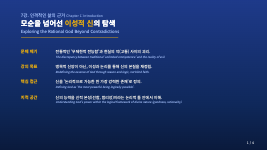

# PRD: Lecture Video Generator

**Version:** 0.3  
**Date:** 2025-12-07  
**Author:** Antigravity

---

## 1. 개요

### 1.1 목적

신학 강의안(DOCX/MD)을 입력받아 **이중언어(한/영) 슬라이드 + 한국어 TTS → 영상**을 자동 생성하는 파이프라인 구축

### 1.2 배경

**현재 워크플로우 (수동):**
1. AI Studio에서 강의안 → 개요 → SVG 생성
2. AI Studio TTS 모델로 교체 → WAV 생성
3. Keynote에 슬라이드 + TTS 파일 → 영상 내보내기

**목표:**
- 반복 단계 자동화 (개요/슬라이드 생성)
- FFmpeg로 영상 조립 (Keynote 불필요)
- 단일 명령어로 영상 생성

---

## 2. 샘플 분석

### 2.1 강의안 샘플 (7-1.md)

```
7강. 인격적인 삶의 근거

1. 서론
2. 신의 전능함에 대한 이성적인 해체와 재구성
3. 악의 문제, 논리로 해소하다
4. 결론: 논리적 신(神)은 어떻게 '나의 근거'가 되는가
```

| 항목 | 값 |
|------|-----|
| 섹션 수 | 4개 |
| 총 분량 | 133줄, ~28KB |
| 슬라이드 예상 | 섹션당 1-2개 → 4~8개 |

### 2.2 오디오 샘플 (1.wav)

| 항목 | 값 |
|------|-----|
| 형식 | WAV (PCM 16bit, mono) |
| 샘플레이트 | 24kHz |
| 길이 | **6분 27초** (386.97초) |
| 섹션당 예상 | ~6분 |

### 2.3 슬라이드 샘플



| 요소 | 스타일 |
|------|--------|
| 배경 | 진한 파란색 그라데이션 |
| 메인 제목 | 흰색 + 노란색 강조, 한/영 병렬 |
| 본문 | 은혜, 핵심 강조, 핵심 요약 섹션 |
| 폰트 | 세리프 계열 |

---

## 3. 파이프라인 설계

### 3.1 워크플로우

```
┌──────────────────────────────────────────────────────────────┐
│  Phase 1: 개요 생성 (자동화)                                  │
│  ┌─────────┐    ┌─────────────┐    ┌──────────────┐          │
│  │ .docx   │ →  │ 파싱        │ →  │ Gemini API   │          │
│  │ .md     │    │             │    │ 이중언어 개요 │          │
│  └─────────┘    └─────────────┘    └──────────────┘          │
└──────────────────────────────────────────────────────────────┘
                              ↓
┌──────────────────────────────────────────────────────────────┐
│  Phase 2: 슬라이드 생성 (자동화)                              │
│  ┌──────────────┐    ┌─────────────┐    ┌──────────┐         │
│  │ 개요 JSON    │ →  │ SVG 템플릿  │ →  │ SVG/PNG  │         │
│  │              │    │ + svgwrite  │    │ x N      │         │
│  └──────────────┘    └─────────────┘    └──────────┘         │
└──────────────────────────────────────────────────────────────┘
                              ↓
┌──────────────────────────────────────────────────────────────┐
│  Phase 3: TTS 생성 (자동화 - Gemini API)                      │
│  ┌──────────────┐    ┌─────────────────────┐    ┌──────────┐ │
│  │ 강의 텍스트  │ →  │ Gemini 2.5 Pro TTS  │ →  │ WAV 파일 │ │
│  │ (정제됨)     │    │ Voice: Enceladus    │    │ x N      │ │
│  └──────────────┘    └─────────────────────┘    └──────────┘ │
└──────────────────────────────────────────────────────────────┘
                              ↓
┌──────────────────────────────────────────────────────────────┐
│  Phase 4: 영상 조립 (자동화 - FFmpeg)                         │
│                                                              │
│  개별 슬라이드 + 오디오 → 개별 MP4                            │
│  ┌──────┐ + ┌──────┐ → ┌──────────┐                          │
│  │ 1.png│   │ 1.wav│   │ part1.mp4│                          │
│  └──────┘   └──────┘   └──────────┘                          │
│                              ↓                               │
│  개별 MP4 → 통합 MP4                                         │
│  ┌──────────┐ + ┌──────────┐ + ... → ┌────────────┐          │
│  │ part1.mp4│   │ part2.mp4│         │ final.mp4  │          │
│  └──────────┘   └──────────┘         └────────────┘          │
└──────────────────────────────────────────────────────────────┘
                              ↓
┌──────────────────────────────────────────────────────────────┐
│  Phase 5: 배포 (수동)                                        │
│  YouTube 업로드                                              │
└──────────────────────────────────────────────────────────────┘
```

### 3.2 FFmpeg 영상 조립 상세

```bash
# 1. 개별 슬라이드 + 오디오 → 개별 MP4
ffmpeg -loop 1 -i slide_01.png -i audio_01.wav \
       -c:v libx264 -tune stillimage -c:a aac \
       -shortest -pix_fmt yuv420p part_01.mp4

# 2. 개별 MP4 → 통합 MP4
ffmpeg -f concat -safe 0 -i parts.txt -c copy final.mp4
```

**parts.txt:**
```
file 'part_01.mp4'
file 'part_02.mp4'
file 'part_03.mp4'
```

---

### 3.3 TTS 생성 (Gemini API)

**설정:**

| 항목 | 값 |
|------|-----|
| 모델 | `gemini-2.5-pro-preview-tts` |
| Voice | `Enceladus` |
| 출력 | WAV (24kHz, mono) |

**코드 예시:**

```python
from google import genai

client = genai.Client(api_key="...")

response = client.models.generate_content(
    model="gemini-2.5-pro-preview-tts",
    contents="강의 텍스트...",
    config={
        "speech_config": {
            "voice_config": {
                "prebuilt_voice_config": {
                    "voice_name": "Enceladus"
                }
            }
        },
        "response_modalities": ["AUDIO"]
    }
)

# WAV 저장
with open("output.wav", "wb") as f:
    f.write(response.audio.data)
```

---

## 4. 입출력 명세

### 4.1 입력

| 파일 | 형식 | 설명 |
|------|------|------|
| 강의안 | `.docx`, `.md` | 섹션 구조 (번호 + 제목 + 본문) |
| 오디오 | `.wav` | 섹션별 TTS (AI Studio 생성) |

### 4.2 중간 산출물

| 파일 | 형식 | 설명 |
|------|------|------|
| 개요 | `outline.json` | 이중언어 개요 (한/영) |
| 슬라이드 | `slide_*.svg`, `slide_*.png` | 개별 슬라이드 |
| TTS 텍스트 | `tts_*.txt` | 정제된 텍스트 (소제목 제거) |
| 개별 영상 | `part_*.mp4` | 슬라이드 + 오디오 |

### 4.3 최종 출력

| 파일 | 형식 | 설명 |
|------|------|------|
| 영상 | `final.mp4` | 통합 영상 (YouTube 업로드용) |

---

## 5. 기술 스택

| 모듈 | 라이브러리 | 용도 |
|------|-----------|------|
| DOCX 파싱 | `python-docx` | 강의안 읽기 |
| MD 파싱 | `markdown`, `re` | 마크다운 파싱 |
| 개요 생성 | `google-generativeai` | Gemini 2.5 Flash |
| SVG 생성 | `svgwrite`, `jinja2` | 템플릿 기반 슬라이드 |
| SVG→PNG | `cairosvg` | 래스터화 |
| TTS | `google-generativeai` | Gemini TTS (Enceladus) |
| 영상 조립 | `ffmpeg` (subprocess) | MP4 생성/병합 |

---

## 6. 프로젝트 구조

```
lecture_video_generator/
├── README.md
├── requirements.txt
├── config.py                 # 설정 (경로, 스타일)
├── pipeline.py               # 메인 오케스트레이터
│
├── modules/
│   ├── __init__.py
│   ├── lecture_parser.py     # DOCX/MD → 섹션 분리
│   ├── outline_generator.py  # Gemini → 이중언어 개요
│   ├── slide_generator.py    # 개요 → SVG → PNG
│   ├── tts_preprocessor.py   # 텍스트 정제 (TTS용)
│   └── video_assembler.py    # FFmpeg 조립
│
├── templates/
│   └── slide_base.svg        # SVG 템플릿
│
├── prompts/
│   └── outline_prompt.md     # 개요 생성 프롬프트
│
├── docs/
│   ├── PRD.md                # 이 문서
│   ├── slide_sample.png      # 슬라이드 샘플
│   ├── 7-1.md                # 강의안 샘플
│   └── 1.wav                 # 오디오 샘플
│
├── input/                    # 강의안 + 오디오 입력
└── output/                   # 영상 출력
```

---

## 7. 개발 마일스톤

### Phase 1: MVP (1주)

- [ ] `lecture_parser.py` - DOCX/MD 섹션 분리
- [ ] `outline_generator.py` - Gemini API 이중언어 개요
- [ ] `slide_generator.py` - SVG 템플릿 기반 슬라이드

### Phase 2: TTS 자동화 (1주)

- [ ] `tts_generator.py` - Gemini TTS API 연동
- [ ] `tts_preprocessor.py` - 텍스트 정제 (소제목 제거)
- [ ] 오디오-슬라이드 매핑 로직

### Phase 3: 영상 조립 (1주)

- [ ] `video_assembler.py` - FFmpeg 개별 조립
- [ ] FFmpeg 병합 (concat)
- [ ] `pipeline.py` - 전체 통합

### Phase 4: 고도화 (향후)

- [ ] 슬라이드 전환 효과
- [ ] 배치 처리 (여러 강의)
- [ ] 다양한 Voice 옵션 지원

---

## 8. 사용 시나리오

```bash
# 1. 강의안 + 오디오 준비
cp lecture.md input/
cp *.wav input/

# 2. 개요 및 슬라이드 생성
python pipeline.py generate input/lecture.md

# 3. TTS 생성 (자동)
python pipeline.py tts input/lecture.md

# 4. 영상 조립
python pipeline.py assemble --input input/ --output output/

# 5. (수동) YouTube 업로드
```

---

## 9. 제약 사항

1. **FFmpeg 필수**: `brew install ffmpeg`
2. **Gemini API 키 필수**: TTS 생성용
3. **한국어 TTS만**: 영어는 YouTube 자동 더빙 활용

---

## 10. 성공 지표

- ✅ 단일 명령어로 MD → 개요/슬라이드 생성
- ✅ FFmpeg로 슬라이드+오디오 → MP4 자동 조립
- ✅ 전체 프로세스 시간 50% 단축 (TTS 제외)

---

## Appendix: SVG 템플릿 스케치

```svg
<svg width="1920" height="1080" xmlns="http://www.w3.org/2000/svg">
  <!-- 배경 그라데이션 -->
  <defs>
    <linearGradient id="bg" x1="0%" y1="0%" x2="100%" y2="100%">
      <stop offset="0%" style="stop-color:#0a1628"/>
      <stop offset="100%" style="stop-color:#1a3a5c"/>
    </linearGradient>
  </defs>
  <rect width="100%" height="100%" fill="url(#bg)"/>
  
  <!-- 상단 강의 제목 -->
  <text x="80" y="60" fill="#888" font-size="20">{{lecture_title}}</text>
  
  <!-- 메인 제목 -->
  <text x="80" y="160" fill="#fff" font-size="56" font-weight="bold">
    {{title_ko}}
  </text>
  <text x="80" y="220" fill="#ffd700" font-size="36">
    {{title_ko_accent}}
  </text>
  <text x="80" y="270" fill="#aaa" font-size="24">{{title_en}}</text>
  
  <!-- 섹션 내용 -->
  <text x="80" y="380" fill="#4a9eff" font-size="18">{{section_label}}</text>
  <text x="80" y="420" fill="#ddd" font-size="24">{{section_content}}</text>
  
  <!-- 페이지 번호 -->
  <text x="1840" y="1040" fill="#666" font-size="18" text-anchor="end">
    {{page_num}} / {{total_pages}}
  </text>
</svg>
```
